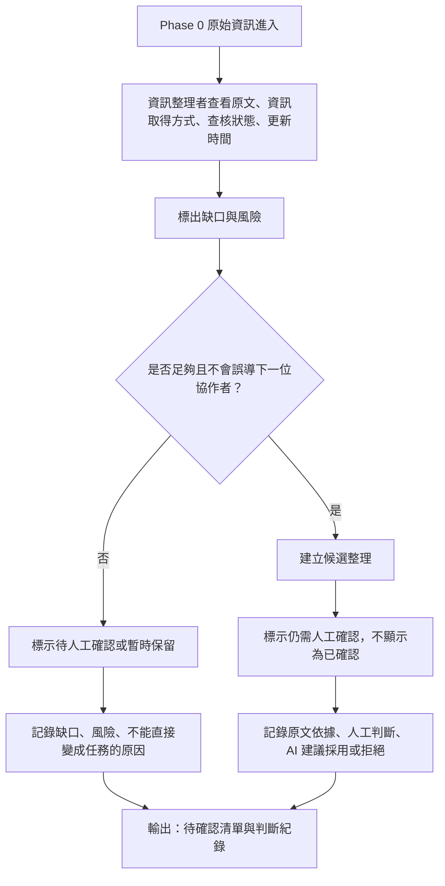

# 資訊流程設計

> 這份文件是 Codex 依 Release 02 Flow Design Kit 產生的流程草稿。Mermaid 需要由人用 VS Code 預覽，並確認流程是否符合小隊實際取捨。

## 我的 v1 目標

- 我優先服務的使用者：資訊整理者。
- 這個使用者最想完成的事：把 Phase 0 原始資訊整理到下一位協作者能理解，同時保留原文、缺口、人工確認需求與判斷紀錄。
- 我最想避免的錯誤：把未確認資訊、整理草稿、最新排序或候選類型誤顯示成已確認、可信或可以行動。

## 自然語言流程描述

請先用自然語言寫流程，不要一開始就寫 Mermaid。

```text
原始資訊進入 v1 工作台後，資訊整理者先查看原文、資訊取得方式、查核狀態與更新時間。

整理者接著標出缺口與風險，例如來源、時間、地點、當事人、現場窗口、原文依據是否不足，或「已整理」「最新」「優先」「任務候選」是否可能被看成已確認或可以出發。

如果資訊不足，或可能誤導下一位協作者，就標示為待人工確認或暫時保留，並記錄缺少哪些資訊、為什麼不能直接變成任務。

只有在原文依據清楚、缺口已被標出、且不會被包裝成已確認任務時，才建立候選整理。候選整理仍然要顯示為待人工確認，不得顯示成 confirmed / verified。

AI 可以協助整理缺口與風險草稿，但不能自動決定資訊是否為真、是否可以派工、是否可以行動。每次人工判斷、AI 建議採用或拒絕、暫時保留或建立候選整理，都要留下紀錄，讓下一位協作者知道為什麼這樣判斷。
```

## Mermaid 流程圖

請讓 Codex 根據上面的自然語言描述產生 Mermaid。

請用 VS Code 預覽，確認流程圖能正常顯示。



## 人工確認點

- 判斷來源、時間、地點、當事人或現場窗口是否足夠。
- 判斷「最新」「優先」「已整理」「候選」等狀態文字是否會誤導使用者。
- 判斷是否可以建立候選整理，以及候選整理需要標示哪些缺口。

## 不能自動處理的分支

- AI 不能自動判斷資訊是否為真、是否已確認、是否可以行動。
- 來源不明、內容模糊、轉述、截圖、電話代述或缺少窗口時，不能自動建立候選結果。
- 可能被行動者誤解成可出發的資訊，不能自動轉成任務候選。

## 操作或判斷紀錄

- 每次標示「需要人工確認」時，要記錄缺少哪些資訊。
- 每次標示「不能直接變成任務」時，要記錄誤導或安全風險。
- 每次建立候選整理時，要記錄原文依據、人工判斷，以及 AI 建議採用或拒絕的理由。
- 每次暫時保留原始資訊時，要記錄暫不採用原因，避免下一位協作者重複猜測。

## 我檢查後修正了什麼

- 原本：流程只在資訊不足時進入人工確認，資訊足夠時直接建立候選整理。
- 修正後：把「資訊是否足夠」和「是否可能誤導」合併成「是否足夠且不會誤導下一位協作者」；即使資訊看起來足夠，也可能先標示為待人工確認或暫時保留。
- 為什麼：Release 01 的三個 subagent 都指出「最新」「優先」「已整理」「候選」可能被誤解成可信或可以出發，所以流程不能只檢查資料欄位是否足夠。

## 我仍不確定的流程點

- 「已整理的」是否應改成「整理草稿」或「待確認整理」，需要人類確認。
- 「優先」是否仍保留為注意力排序，或改成比較不暗示急迫性的文字，需要小隊討論。
- 候選整理需要記錄到多細，才足夠讓下一位協作者理解，但又不會讓整理者負擔太重。
